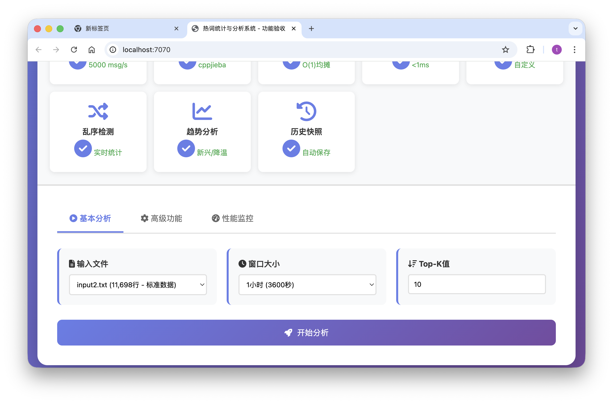

# 🔥 热词统计与分析系统

[](LICENSE)
[](Dockerfile)
[](https://www.python.org/)
[](https://isocpp.org/)

> 一个高性能的实时热词统计与分析系统，支持中文分词、滑动窗口分析、Web 可视化界面。



---

## 🚀 一分钟快速部署

### Docker 一键部署（推荐 ⭐）

确保已安装 [Docker](https://www.docker.com/get-started) 和 Docker Compose，然后：

```bash
# 1. 克隆项目
git clone https://github.com/almosteverywhereau/hotwords-analysis.git
cd hotwords-analysis

# 2. 一键启动（自动编译+运行）
docker-compose up -d

# 3. 访问 Web 界面
# 浏览器打开: http://localhost:5000
```

**就这么简单！** 🎉 系统会自动：
- ✅ 拉取基础镜像
- ✅ 编译 C++ 程序
- ✅ 安装 Python 依赖
- ✅ 启动 Web 服务

### 常用 Docker 命令

```bash
# 查看运行状态
docker-compose ps

# 查看日志
docker-compose logs -f

# 停止服务
docker-compose down

# 重启服务
docker-compose restart

# 更新并重启
docker-compose up -d --build
```

---

## ✨ 核心特性

- 🚀 **高性能处理**: 支持 5000+ 消息/秒的实时处理
- 🔤 **中文分词**: 基于 CppJieba 的高效中文分词
- 📊 **滑动窗口**: 动态追踪热词变化趋势
- 🏆 **Top-K查询**: 实时热词排行榜
- 📈 **趋势分析**: 词频变化可视化图表
- 🔍 **智能过滤**: TF-IDF 算法 + 停用词过滤
- � **容器化部署**: Docker 一键启动
- 🌐 **Web界面**: 美观的可视化界面

---

## � 使用指南

### Web 界面操作

1. **上传文件**: 点击"选择文件"，支持 `.txt` 格式（UTF-8 编码）
2. **设置参数**:
   - **窗口大小 (W)**: 每次分析的句子数量，默认 100
   - **滑动步长 (S)**: 窗口移动步数，默认 10
   - **Top-K**: 显示前 K 个热词，默认 10
3. **查看结果**:
   - 📊 Top-10 热词排行榜
   - 📈 词频变化趋势图
   - � 热词详细统计表

### 命令行使用

```bash
# 直接使用 C++ 程序分析
./hotwords <窗口大小> <滑动步长> <TopK> <输入文件> <输出文件>

# 示例
./hotwords 100 10 10 input1.txt output.txt
```

---

## 🛠️ 本地部署（不使用 Docker）

### 前置要求

- **编译器**: GCC 7+ / Clang 5+ (支持 C++17)
- **Python**: 3.8+
- **Make**: 构建工具

### 安装步骤

```bash
# 1. 克隆项目
git clone https://github.com/almosteverywhereau/hotwords-analysis.git
cd hotwords-analysis
cd hotwords-analysis

# 2. 编译 C++ 程序
g++ -std=c++17 -O3 -o hotwords hotwords.cpp \
    -I./cppjieba -pthread

# 3. 安装 Python 依赖
pip install -r requirements.txt

# 2. 安装 Python 依赖
pip3 install flask flask-cors

# 3. 编译 C++ 程序
make

# 4. 启动 Web 服务
python3 web_server.py

# 5. 浏览器访问
# http://localhost:5000
```

### 或使用快速启动脚本

```bash
chmod +x start.sh
./start.sh
# 选择部署方式（Docker 或本地）
```

---

## 📊 测试数据

项目自带 3 个测试文件:

- **input1.txt**: 小型数据集 (~100 句)
- **input2.txt**: 中型数据集 (~500 句)
- **input3.txt**: 大型数据集 (~2000 句)

直接在 Web 界面上传测试即可！

---

## 🏗️ 项目结构

```
hotwords-analysis/
├── 📄 hotwords.cpp           # C++ 核心算法
├── 🌐 web_server.py          # Flask Web 服务器
├── 🐳 Dockerfile             # Docker 镜像配置
├── 🐳 docker-compose.yml     # Docker Compose 编排
├── 🚀 start.sh               # 快速启动脚本
├── 🔨 Makefile               # 编译配置
├── 📋 templates/
│   └── index.html           # Web 前端界面
├── 📚 cppjieba/             # CppJieba 分词库
├── 📖 dict/                 # 词典文件
│   ├── jieba.dict.utf8     # 分词词典
│   ├── hmm_model.utf8      # HMM 模型
│   ├── idf.utf8            # IDF 词典
│   └── stop_words.utf8     # 停用词表
├── 📝 input1.txt            # 测试数据 1
├── 📝 input2.txt            # 测试数据 2
└── 📝 input3.txt            # 测试数据 3
```

---

## 🐳 Docker 详细说明

### Dockerfile 说明

```dockerfile
FROM ubuntu:22.04              # 基础镜像
RUN apt-get install g++ make   # 安装编译工具
RUN pip3 install flask         # 安装 Python 依赖
COPY . /app/                   # 复制项目文件
RUN make                       # 编译 C++ 程序
CMD ["python3", "web_server.py"]  # 启动服务
```

### docker-compose.yml 说明

```yaml
version: '3.8'
services:
  hotwords-app:
    build: .                    # 构建镜像
    ports:
      - "5000:5000"            # 端口映射 (主机:容器)
    volumes:
      - ./uploads:/app/uploads  # 文件上传目录
      - ./test_results:/app/test_results  # 结果输出目录
    restart: unless-stopped    # 自动重启
```

### 端口修改

如果 5000 端口被占用，修改 `docker-compose.yml`:

```yaml
ports:
  - "8080:5000"  # 改为 8080 或其他端口
```

然后访问 `http://localhost:8080`

---

## 🔧 技术栈

| 层级 | 技术 | 说明 |
|------|------|------|
| **后端算法** | C++17 | 核心热词统计算法 |
| **中文分词** | CppJieba | 高性能分词引擎 |
| **Web 服务** | Flask | Python Web 框架 |
| **前端界面** | HTML/CSS/JS | 响应式界面设计 |
| **数据可视化** | Chart.js | 动态图表展示 |
| **容器化** | Docker | 一键部署 |

---

## 🐛 故障排除

### Docker 相关问题

#### 1. `docker-compose: command not found`

**解决方案**:

```bash
# 方案 A: 安装 docker-compose
pip3 install docker-compose

# 方案 B: 使用新版 Docker CLI
docker compose up -d  # 注意没有连字符
```

#### 2. 端口 5000 被占用

```bash
# 查看端口占用
lsof -i :5000

# 修改端口映射
vim docker-compose.yml
# 改为: - "8080:5000"
```

#### 3. 容器启动失败

```bash
# 查看详细日志
docker-compose logs -f

# 重新构建
docker-compose down
docker-compose up -d --build
```

### 本地部署问题

#### 1. 编译错误: `Jieba.hpp not found`

```bash
# 确保头文件路径正确
g++ -std=c++17 -O3 -o hotwords hotwords.cpp -I./cppjieba
```

#### 2. Python 模块缺失

```bash
# 安装依赖
pip3 install flask flask-cors
```

#### 3. 权限问题

```bash
# 添加执行权限
chmod +x hotwords
chmod +x start.sh
```

### 分析结果问题

#### Q: Top-K 显示少于 10 个词？

**这是正常现象！** 可能原因:

- ✅ 窗口内有效词汇少于 K
- ✅ 滑动到文件末尾，剩余句子不足
- ✅ 停用词过滤后词汇不足

**建议**:
- 增大窗口大小
- 减小 K 值
- 检查输入数据质量

---

## 🤝 贡献

欢迎贡献代码、报告问题或提出建议！

## 📄 许可证

MIT License - 详见 [LICENSE](LICENSE)

## 🙏 致谢

- [cppjieba](https://github.com/yanyiwu/cppjieba) - 中文分词库
- [Flask](https://flask.palletsprojects.com/) - Web框架
- [Chart.js](https://www.chartjs.org/) - 数据可视化

---


⭐ 如果这个项目对你有帮助，请给个 Star！


